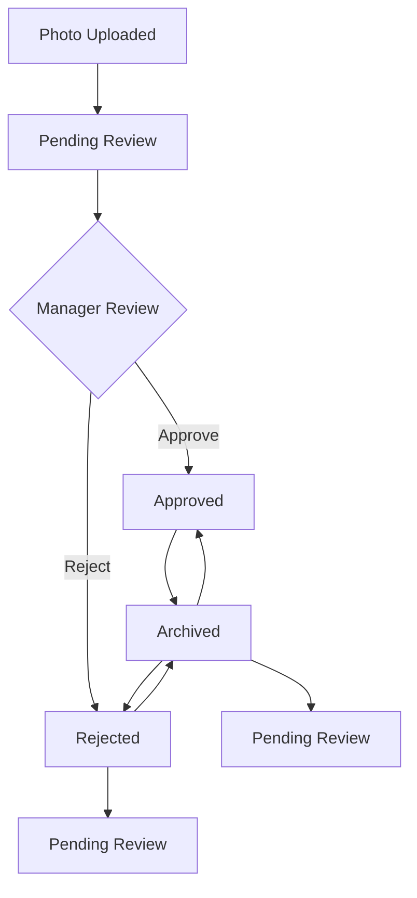

# Photo Approval Workflow

**Date**: September 30, 2025  
**Feature**: Photo Management System  
**Version**: 1.0.0

## Overview

The Photo Approval Workflow provides managers and superusers with a comprehensive system for reviewing, approving, and managing photos across all tasks in the AriStay platform. This workflow ensures quality control and proper documentation of property maintenance activities.

## Workflow States

### Photo Status Lifecycle



### Status Definitions

| Status | Description | Actions Available |
|--------|-------------|-------------------|
| **Pending** | Newly uploaded, awaiting review | Approve, Reject |
| **Approved** | Manager approved, ready for use | Archive, Reject |
| **Rejected** | Rejected by manager, needs attention | Approve, Archive, Pending |
| **Archived** | Archived for long-term storage | Approve, Reject, Pending |

## User Roles & Permissions

### Manager/Superuser Capabilities
- ✅ View all photos across all tasks
- ✅ Approve/reject photos
- ✅ Archive photos
- ✅ Change photo status (any transition)
- ✅ Bulk operations on multiple photos
- ✅ Access photo management dashboard

### Staff Capabilities
- ✅ Upload photos to assigned tasks
- ✅ View photos for assigned tasks
- ✅ View photo status and metadata
- ❌ Cannot approve/reject photos
- ❌ Cannot change photo status

### Viewer Capabilities
- ✅ View approved photos only
- ❌ Cannot upload photos
- ❌ Cannot change photo status

## Approval Process

### Step 1: Photo Upload
1. Staff member uploads photo to task
2. Photo automatically set to "Pending" status
3. System generates unique sequence number
4. Photo metadata recorded (type, date, user)

### Step 2: Manager Review
1. Manager accesses photo management dashboard
2. Filters photos by status, task, or type
3. Reviews photo quality and relevance
4. Makes approval decision

### Step 3: Status Update
1. Manager selects appropriate action
2. System validates status transition
3. Photo status updated in database
4. Audit trail recorded
5. Notifications sent (if configured)

### Step 4: Follow-up Actions
1. Approved photos available for reporting
2. Rejected photos require staff attention
3. Archived photos stored for long-term reference

## User Interface Components

### Photo Management Dashboard
- **Statistics Overview**: Real-time counts by status
- **Filter Controls**: Task, status, type, date filters
- **Photo Grid**: Responsive card layout
- **Bulk Actions**: Multi-select operations

### Photo Card Elements
- **Thumbnail**: Optimized image preview
- **Status Badge**: Color-coded status indicator
- **Metadata**: ID, sequence, date, type
- **Action Buttons**: Context-aware controls
- **Hover Overlay**: Quick action access

### Photo Modal Viewer
- **Full-Size Display**: High-resolution viewing
- **Zoom Controls**: In/out/reset functionality
- **Metadata Panel**: Detailed photo information
- **Action Butflows**: Direct status updates
- **Keyboard Shortcuts**: Efficient navigation

## Business Rules

### Status Transition Rules
```python
# Valid transitions based on current status
valid_transitions = {
    'pending': ['approved', 'rejected'],
    'approved': ['archived', 'rejected'],
    'rejected': ['pending', 'archived', 'approved'],
    'archived': ['pending', 'approved', 'rejected']
}
```

### Photo Type Classifications
- **Before**: Photos taken before task completion
- **After**: Photos taken after task completion
- **Checklist**: Photos associated with checklist items

### Quality Standards
- **Resolution**: Minimum 1024x768 pixels
- **Format**: JPEG, PNG, or MPO only
- **Size**: Maximum 25MB per photo
- **Content**: Must be relevant to task

## Notification System

### Status Change Notifications
- **Approved**: Notify task assignee of approval
- **Rejected**: Notify task assignee with reason
- **Archived**: Notify relevant stakeholders

### Notification Channels
- **In-App**: Real-time dashboard updates
- **Email**: Optional email notifications
- **Mobile**: Push notifications (future)

## Audit Trail

### Logged Events
- Photo upload with metadata
- Status changes with user and timestamp
- Bulk operations with affected photo count
- System errors and warnings

### Audit Data Structure
```json
{
    "event_type": "photo_status_change",
    "user": "manager@example.com",
    "photo_id": 123,
    "old_status": "pending",
    "new_status": "approved",
    "timestamp": "2025-09-30T10:30:00Z",
    "reason": "Photo meets quality standards"
}
```

## Performance Considerations

### Database Optimization
- Indexed status and type fields
- Efficient query patterns
- Soft delete implementation
- Connection pooling

### Frontend Performance
- Lazy loading of thumbnails
- Pagination for large datasets
- Efficient DOM updates
- Cached API responses

### Storage Management
- Automatic image optimization
- CDN integration (future)
- Cleanup of orphaned files
- Backup and archival

## Error Handling

### Common Error Scenarios
- **Invalid Status Transition**: Business rule violation
- **Permission Denied**: Insufficient user rights
- **File Upload Error**: Invalid file or size limit
- **Network Error**: Connection or timeout issues

### Error Recovery
- Automatic retry for transient errors
- User-friendly error messages
- Fallback mechanisms for critical functions
- Comprehensive logging for debugging

## Testing Strategy

### Test Coverage
- **Unit Tests**: Business logic and validation
- **Integration Tests**: API endpoints and workflows
- **UI Tests**: User interface interactions
- **Security Tests**: Permission and access control

### Test Scenarios
- Photo upload and status updates
- Permission validation
- Status transition validation
- Bulk operations
- Error handling

## Configuration

### Environment Settings
```python
# Photo approval settings
PHOTO_APPROVAL_ENABLED = True
PHOTO_STATUS_TRANSITIONS = {
    'pending': ['approved', 'rejected'],
    'approved': ['archived', 'rejected'],
    'rejected': ['pending', 'archived', 'approved'],
    'archived': ['pending', 'approved', 'rejected']
}

# Notification settings
PHOTO_NOTIFICATIONS_ENABLED = True
PHOTO_APPROVAL_EMAIL_TEMPLATE = 'photo_approval_notification.html'
```

### User Interface Settings
```javascript
// Photo management UI configuration
const PHOTO_MANAGEMENT_CONFIG = {
    itemsPerPage: 20,
    thumbnailSize: '200x200',
    maxFileSize: 25 * 1024 * 1024, // 25MB
    allowedTypes: ['image/jpeg', 'image/png', 'image/mpo'],
    autoRefresh: true,
    refreshInterval: 30000 // 30 seconds
};
```

## Monitoring & Analytics

### Key Metrics
- **Approval Rate**: Percentage of photos approved
- **Processing Time**: Average time from upload to approval
- **Rejection Rate**: Percentage of photos rejected
- **User Activity**: Manager engagement with photo review

### Performance Monitoring
- **API Response Times**: Photo management endpoints
- **Database Query Performance**: Status and filter queries
- **File Upload Success Rate**: Upload completion percentage
- **Error Rates**: Failed operations and error types

## Security Considerations

### Access Control
- Role-based permission system
- JWT token authentication
- CSRF protection for all forms
- Rate limiting on API endpoints

### Data Protection
- Secure file storage
- Encrypted data transmission
- Audit trail for compliance
- Privacy controls for sensitive photos

### File Security
- File type validation
- Size limit enforcement
- Content scanning (future)
- Secure deletion of rejected files

## Future Enhancements

### Planned Features
- **AI-Powered Review**: Automatic quality assessment
- **Batch Approval**: Multi-photo selection and approval
- **Photo Annotations**: Drawing and markup tools
- **Advanced Analytics**: Detailed reporting and insights

### Technical Improvements
- **Real-time Updates**: WebSocket integration
- **Mobile App**: Native mobile interface
- **Offline Support**: Local photo management
- **API Versioning**: Backward compatibility

## Troubleshooting Guide

### Common Issues

#### Photos Not Appearing
1. Check user permissions
2. Verify task assignment
3. Confirm photo status
4. Review filter settings

#### Status Update Failures
1. Verify user role
2. Check status transition rules
3. Confirm photo exists
4. Review error logs

#### Performance Issues
1. Check database indexes
2. Review query performance
3. Verify file storage
4. Monitor system resources

### Support Contacts
- **Technical Issues**: Development Team
- **User Training**: Product Team
- **System Administration**: DevOps Team
- **Security Concerns**: Security Team

## Conclusion

The Photo Approval Workflow provides a comprehensive, secure, and user-friendly system for managing photo approvals across the AriStay platform. The workflow ensures quality control while maintaining efficiency and providing clear audit trails for compliance purposes.

**Key Benefits:**
- ✅ Streamlined approval process
- ✅ Role-based access control
- ✅ Comprehensive audit trail
- ✅ User-friendly interface
- ✅ Scalable architecture

The system is production-ready and provides a solid foundation for future photo management enhancements.
